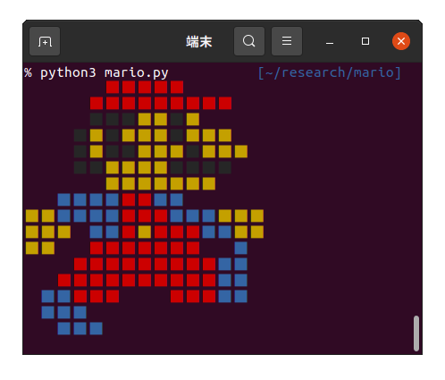

# マリオコンソールアート

マリオがターミナルで走ります．



windowsのcmdだとたぶん動きません (todo: 確認)

## 使い方
```
python3 mario.py
```

以下のコマンドは絶対に実行しないでください．  
主要なコマンドがすべて上記のコマンドに置き換わってしまいます．  
絶対に，ロックをかけないで放置している友達のターミナルで実行しないでください．  
※実行しても責任は取れません
```
source dont_run.sh
```

## TODO

- ジャンプパターン追加
- ルイージと一緒に走るパターン追加
- 走ったり切り替えしたりジャンプしたりするパターン追加
- コンソール中央で表示
- linuxコマンド化
- windows環境で動作確認